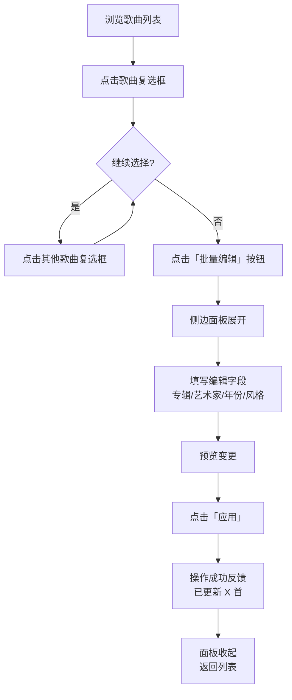
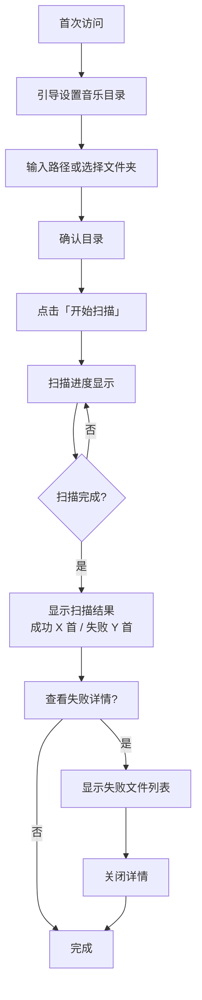
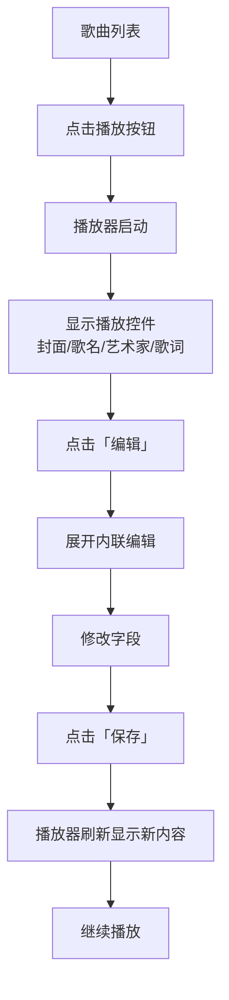

# UX Design Specification nas-manager

**Author:** 立子
**Date:** 2026-04-15

---

<!-- UX design content will be appended sequentially through collaborative workflow steps -->

## Executive Summary

### Project Vision

极客工具箱是一款面向 NAS 用户的音乐元数据批量管理工具，采用极简主义设计，追求"批量编辑的极致效率"。不做流媒体播放器，精准服务音乐库整理场景，让用户感受到"终于有一个工具能理解我的痛点"。

### Target Users

**主要用户：** 有一定技术能力的个人 NAS 用户
- 音乐文件已存储在 NAS 上，缺乏好用的批量维护工具
- 目前只能一首首处理，功能极少
- 追求高效、简洁、开源的工具

**使用特征：**
- 常用歌手视图进行浏览
- 典型批量大小：30 首以内
- 主要场景：纯整理（不边听边改）
- PC 和移动端都会使用

### Key Design Challenges

1. **批量编辑效率** — 30首以内的批量操作，需设计最小点击次数的编辑流程
2. **快速定位与选择** — 歌手视图下，如何高效选中同一专辑的多首歌
3. **移动端适配** — 手机上完成批量编辑，触摸交互的精确度挑战

### Design Opportunities

1. **批量操作的极致效率** — 批量选、批量改、批量确认，三步完成
2. **部分选择批量归类** — 从歌手视图展开后，手动勾选要归类的歌曲，批量设置专辑名
3. **移动优先的触摸设计** — 卡片视图 + 大触摸目标 + 滑动操作

## Core User Experience

### Defining Experience

**核心用户动作：** 批量选择歌曲 → 设置专辑

**选择挑战：** 用户需要根据"原专辑名有共同点"或"相同关键词"来定位和选择目标歌曲。选择过程是整个流程中最需要设计好的部分。

**选择 → 设置，两步极致：**
1. 搜索和选择做到极致
2. 输入编辑信息完全不费力

### Platform Strategy

- **平台：** Web（Chrome 桌面端 + 移动端）
- **交互模式：** 触摸为主，支持PC鼠标操作
- **响应式：** PC列表视图 / 手机卡片视图
- **离线：** 纯本地工具，无需联网

### Effortless Interactions

1. **搜索选择极效：** 支持多条件组合筛选，快速定位目标歌曲
2. **批量编辑极简：** 选中后编辑面板只需填写"新专辑名"，一键应用
3. **选择预览确认：** 让用户清晰看到"这是我选的那些歌"

### Critical Success Moments

1. **选中正确歌曲** — 用户能快速、准确地从大量歌曲中选出目标批次
2. **编辑预览** — 提交前清晰预览变更结果，减少误操作
3. **操作完成确认** — 批量修改成功，用户感到效率提升

### Experience Principles

1. **选择优先** — 设计一切围绕"如何让用户快速选对歌曲"
2. **最小输入** — 编辑操作只需填必要信息，零冗余字段
3. **所见即所选** — 选择列表和编辑操作在同一界面，所见即所得

## Desired Emotional Response

### Primary Emotional Goals

**核心情感：** 解放感 + 效率爆棚
- "终于不用一个个改了，歌曲也更规整了"
- 批量操作带来的成就感："原来我可以这么快整理完整个专辑"

**情感差异化：** 目前市面上缺乏好用的批量音乐管理工具，用户会有"终于等到你"的感觉

### Emotional Journey Mapping

| 阶段 | 情感 |
|------|------|
| 首次使用 | "不需要配置，直接能用"——上手零门槛 |
| 批量选择 | 快速选中目标歌曲，信心感——"这就是我要的那些歌" |
| 批量编辑 | 极简操作，输入新专辑名，一键应用 |
| 完成确认 | 效率爆棚，"原来整理音乐可以这么快" |
| 如有错误 | 改错了没事儿，撤销即可恢复 |

### Micro-Emotions

**追求的情感：**
- **掌控感** — "我的音乐库我做主"，批量操作尽在掌握
- **成就感** — 一次操作整理几十首歌，效率爆棚
- **解放感** — 终于告别一首首改的痛苦

**避免的情感：**
- **恐惧** — 担心破坏音乐文件本身（这是底线，绝对不能发生）
- **焦虑** — 不确定自己选对了哪些歌曲

### Design Implications

| 情感 | UX 设计支撑 |
|------|-------------|
| 掌控感 | 所见即所选，选择列表和编辑操作同界面 |
| 成就感 | 批量操作完成后展示"本次整理 X 首"的成就反馈 |
| 解放感 | 最小输入设计，一键应用，减少操作负担 |
| 安全感 | 元数据编辑绝不触碰原始音频文件，撤销机制完善 |

### Emotional Design Principles

1. **安全感第一** — 任何编辑操作只改元数据，不碰音频文件本身
2. **低风险高回报** — 强调"改错了可以撤销"，鼓励批量操作
3. **成就感可视化** — 完成批量操作后，给出明确的成果反馈

## UX Pattern Analysis & Inspiration

### Inspiring Products Analysis

**参考产品：** 目前市面上缺乏专门针对 NAS 音乐批量整理的精品工具，用户主要从以下产品类型中获取体验参考：

| 产品类型 | 值得借鉴的 UX |
|---------|---------------|
| 文件管理器（如 Finder） | 多选操作、批量重命名 |
| 音乐播放器（如 Music） | 歌手/专辑浏览、播放控件 |
| 照片管理（如 Google Photos） | 多选模式、批量标签编辑 |

### Transferable UX Patterns

**批量操作模式：**
- **多选模式** — 选中当前项后，点击其他项添加到选择集（Shift 多选连续项，Cmd/Ctrl 多选不连续项）
- **全选本页/全选全部** — 快速选中当前筛选结果
- **批量操作栏** — 选中后底部/顶部出现批量操作浮动栏

**编辑预览模式：**
- **即时预览** — 编辑前预览效果，确认后再应用
- **撤销支持** — 每次批量操作记录可单独撤销

**搜索过滤模式：**
- **输入完成搜索** — 边输入边过滤对中文输入不友好，输入完成后回车搜索 + 按钮触发
- **组合筛选** — 支持多个筛选条件组合（歌手 + 专辑 + 格式等）

### Anti-Patterns to Avoid

| 避免的模式 | 原因 |
|-----------|------|
| 打开编辑弹窗 → 关闭弹窗 → 再选歌 | 操作断裂，效率低 |
| 选中后需进入详情页才能编辑 | 增加不必要的点击 |
| 批量编辑强制填写所有字段 | 与"最小输入"原则冲突 |
| 操作完成后无明确反馈 | 用户不知道操作是否成功 |

### Design Inspiration Strategy

**借鉴要点：**
- 文件管理器的多选交互 + 批量操作浮动栏
- 播放器简洁的播放控制设计
- Google Photos 的多选模式 + 批量标签编辑

**避免踩坑：**
- 不要学传统音乐播放器的"打开详情页 → 编辑 → 保存 → 关闭"的低效流程
- 不要学桌面应用的多窗口模式，保持单页操作

**极简主义哲学：**
- 界面简洁，信息密度适中
- 所见即所得的操作方式
- 减少模态弹窗，使用内联编辑

## Design System Foundation

### Design System Choice

**选择：** Tailwind CSS

### Rationale for Selection

- **极简哲学匹配** — Tailwind 原子化 CSS，按需生成，无冗余样式
- **快速开发** — 单人开发需要效率，Tailwind 组件化设计加速 UI 构建
- **高度定制** — 配合极简主义风格，可精细控制每一个视觉元素
- **与 Preact 轻量栈契合** — 不引入重型 UI 框架

### Implementation Approach

- 使用 Tailwind CSS 原生样式类
- 组件使用 Preact 编写
- 保持样式与逻辑分离
- 深色/浅色主题支持（可选）

### Customization Strategy

- 自定义 Tailwind 配置适配项目色彩体系
- 使用 Tailwind 插件扩展必要功能
- 保持默认间距/字体系统，利用 Tailwind 规范

## 2. Core User Experience

### 2.1 Defining Experience

**核心描述：** 选中一批歌，一次性设置专辑

**一句话描述：** "像给文件夹批量贴标签一样，给散落的音乐贴上正确的专辑标签"

**核心交互流程：**
1. 用户浏览/搜索定位目标歌曲
2. 多选要操作的目标歌曲
3. 输入新专辑名
4. 预览确认
5. 一键应用

### 2.2 User Mental Model

**用户心理模型：** 给散落的歌曲按来源归类

**用户场景：**
- 某歌手的影视剧原声带散落各处，想把同一剧的原声带归到同一个专辑
- 在歌曲比赛里唱的歌，相同比赛算一个专辑
- 用户的音乐播放器会根据专辑名组织显示，归类后播放时更整洁

**用户预期：**
- 操作像"按来源批量贴标签"一样简单
- 预览确认后，播放器里就能按来源归类显示了

### 2.3 Success Criteria

**核心成功标准：**
- 编辑后预览确认没有问题
- 预览时清晰展示"选中了哪些歌"和"将要改成什么"
- 操作完成后，用户在播放器里能看到整理后的效果

**体验成功标志：**
- 用户感到"这比我想象的要快"
- 用户知道"这就是我要的那批歌"
- 用户相信"预览确认了就不会错"

### 2.4 Novel UX Patterns

**模式分析：** 使用成熟的批量选择 + 即时预览模式

- 批量选择：文件管理器的多选模式（成熟模式）
- 即时预览：所见即所得的编辑预览（成熟模式）
- 创新点：内联编辑 + 批量操作浮动栏的结合

### 2.5 Experience Mechanics

**核心交互流程：**

1. **启动选择**
   - 用户通过歌手/专辑/文件夹视图浏览
   - 点击歌曲进入选择状态
   - 点击其他歌曲添加到选择集

2. **批量操作栏**
   - 选中歌曲后，底部出现批量操作浮动栏
   - 显示"已选中 X 首"
   - 显示"设置专辑"等操作按钮

3. **编辑预览**
   - 点击"设置专辑"后，内联展开编辑区域
   - 显示已选中的歌曲列表
   - 输入框填写"新专辑名"
   - 实时预览将要做的更改

4. **确认应用**
   - 点击"应用"后执行更改
   - 展示操作成功反馈（"已更新 X 首"）
   - 保持选择状态，可继续操作

## Visual Design Foundation

### Color System

**主题：** 亮色主题（Light Theme）

**色彩方向：** 新鲜、活泼、专业

**配色建议：**
| 用途 | 色值 | 说明 |
|------|------|------|
| 背景色 | #FFFFFF / #F0FDF4 | 主背景/浅绿底色 |
| 文字色 | #1E293B / #64748B | 主文字/次要文字 |
| 主色调 | #22C55E | 绿色，代表活力、新鲜 |
| 辅助色 | #3B82F6 | 蓝色，交互操作 |
| 强调色 | #F97316 | 橙色，突出重点 |
| 警示色 | #EAB308 | 黄色，警告提示 |
| 错误色 | #EF4444 | 红色，错误/删除 |
| 边框色 | #E2E8F0 | 浅灰，分割线 |

**语义色彩映射：**
- Primary: #22C55E（绿色，活力感）
- Secondary: #3B82F6（蓝色，交互）
- Accent: #F97316（橙色，强调）
- Success: #22C55E（成功反馈）
- Warning: #EAB308（警告提示）
- Error: #EF4444（错误/危险操作）
- Background: #FFFFFF / #F0FDF4
- Text: #1E293B / #64748B

**色彩情绪：** 绿色为主调，传达"新鲜、活力、整理后清爽"的感觉

### Typography System

**字体策略：** 中英文兼顾，简体繁体兼容

**字体选择：**
- **中文字体：** 思源黑体 / Noto Sans CJK（支持简繁体）
- **英文字体：** Inter（现代、清晰）
- **等宽字体：** JetBrains Mono / SF Mono

**字号层级：**
| 层级 | 字号 | 用途 |
|------|------|------|
| H1 | 24px | 页面标题 |
| H2 | 20px | 区块标题 |
| H3 | 16px | 卡片标题 |
| Body | 14px | 正文内容 |
| Small | 12px | 辅助说明 |

**行高：** 1.5（正文）/ 1.3（标题）

### Spacing & Layout Foundation

**布局哲学：** 简洁高效，信息密度适中

**间距系统：** 基于 4px 基准
- xs: 4px
- sm: 8px
- md: 16px
- lg: 24px
- xl: 32px

**布局原则：**
- 单页应用，减少页面跳转
- 选择列表和编辑操作同界面
- 批量操作浮动栏固定底部
- 卡片/列表视图自适应

### Accessibility Considerations

- **对比度：** 文字与背景对比度 ≥ 4.5:1
- **触摸目标：** 最小 44x44px（移动端）
- **焦点可见：** 键盘导航时焦点清晰可见
- **字体支持：** 简体繁体日文韩文全覆盖（Noto CJK）

## Design Direction Decision

### Design Directions Explored

| 方向 | 特点 | 适合场景 |
|------|------|----------|
| 方向1: 经典简洁 | 左侧导航 + 右侧内容 | 多内容类型切换 |
| 方向2: 沉浸式内容 | 顶部Tab + 全宽内容 | 视觉沉浸 |
| 方向3: 紧凑高效 | 高密度表格视图 | 大量数据管理 |
| 方向4: 卡片网格 | 视觉化卡片展示 | 移动端友好 |

### Chosen Direction

**选择：方向3 — 紧凑高效**

**特点：**
- 高密度表格视图，单屏显示更多歌曲
- 紧凑布局，适合批量操作效率优先
- 清晰的行列结构，选中状态明显

### Design Rationale

**为什么选择方向3：**
- **效率优先：** 30首以内的批量操作，高密度视图减少滚动
- **信息清晰：** 表格结构清晰显示歌曲、专辑、时长等信息
- **操作便捷：** 批量选择后直接触发编辑，无需进入详情页

### Implementation Approach

**批量编辑支持多字段：**
- 专辑（Album）
- 艺术家（Artist）
- 年份（Year）
- 风格（Genre）

**编辑交互：**
- 选中歌曲后，点击「批量编辑」展开编辑面板
- 各字段支持单独修改（填写即更新，留空即不变）
- 预览确认后再应用

## User Journey Flows

### Journey 1: 批量选择与编辑流程

**用户目标：** 快速选中一批歌曲，批量修改元数据

**流程图：**

**关键交互细节：**

| 步骤 | 交互 | 说明 |
|------|------|------|
| 选择 | Checkbox 多选 | 点击复选框添加/移除选中状态 |
| 批量操作栏 | 固定显示 | 显示「已选中 X 首」+「批量编辑」按钮 |
| 侧边面板 | 右侧滑入 | 宽度约 320px，不遮挡主列表 |
| 字段编辑 | 留空不变 | 只填写要修改的字段，留空则不变 |
| 预览 | 内联预览 | 实时显示将要变更的内容 |
| 确认 | 一键应用 | 成功后显示「已更新 X 首」 |

### Journey 2: 首次配置与音乐扫描

**用户目标：** 设置音乐目录并扫描音乐文件

**流程图：**

### Journey 3: 播放并现场编辑

**用户目标：** 播放歌曲时快速编辑元数据

**流程图：**

### Journey Patterns

**导航模式：**
- 顶部 Tab 切换视图（歌手/专辑/文件夹）
- 紧凑表格列表，高效浏览

**选择模式：**
- Checkbox 多选，支持连续多选
- 选中状态高亮显示

**编辑模式：**
- 侧边面板编辑，不遮挡主内容
- 字段留空 = 保持不变
- 实时预览变更内容

**反馈模式：**
- 操作成功：Toast 提示 + 数字反馈
- 批量操作：展示「已更新 X 首」

## Component Strategy

### Design System Components

**来自 Tailwind CSS 的基础组件：**

| 组件类型 | 可用组件 |
|---------|---------|
| 基础 | Button、Input、Checkbox、Select、Badge |
| 布局 | Container、Stack、Grid |
| 反馈 | Toast、Alert、Progress |
| 导航 | Tabs、Breadcrumb |

### Custom Components

#### 1. 歌曲表格行 (SongTableRow)

**用途：** 高密度歌曲列表中的单行展示

**列结构：**

| 列 | 宽度 | 内容 |
|----|------|------|
| 选择 | 32px | 复选框 |
| 封面 | 40px | 封面缩略图 |
| 歌名 | flex | 歌曲名称 |
| 艺术家 | 120px | 艺术家名 |
| 专辑 | 150px | 专辑名 |
| 年份 | 60px | 发行年份 |
| 流派 | 80px | 音乐流派 |
| 时长 | 50px | 播放时长 |
| 操作 | 40px | 操作菜单 |

**封面状态：**
- 有封面：显示封面图（40x40px，圆角）
- 无封面：灰色占位 + 音符图标 + 橙色虚线边框

**行状态：**
- 默认：白底
- 悬停：浅灰背景 (#F9FAFB)
- 选中：主题色背景 (#F0FDF4) + 复选框勾选
- 播放中：左侧 3px 主题色条

#### 2. 侧边编辑面板 (SideEditPanel)

**用途：** 右侧滑入的批量编辑面板

**内容：**
- 标题（已选中 X 首）
- 歌曲预览列表
- 编辑字段表单
- 预览区域
- 操作按钮

**字段：**
- 专辑（Album）
- 艺术家（Artist）
- 年份（Year）
- 风格（Genre）

**交互：**
- 留空字段 = 保持不变
- 填写字段 = 预览显示新值
- 点击「应用」= 执行修改

#### 3. 侧边播放器 (SidePlayer)

**用途：** 右侧固定区域，显示播放状态和歌词

**内容：**
- 封面大图（200x200px）
- 歌名、艺术家、专辑
- 播放进度条
- 播放控制（上一首/播放暂停/下一首）
- 歌词显示区域
- 编辑按钮

**状态：**
- 无播放：收起状态
- 播放中：展开状态，显示完整信息
- 歌词同步：高亮当前行

#### 4. 选择操作栏 (SelectionBar)

**用途：** 固定在列表上方，显示选择状态

**内容：**
- 已选中数量
- 全选/取消全选
- 批量编辑按钮
- 取消选择

#### 5. Toast 提示 (Toast)

**用途：** 操作反馈

**类型：**
- 成功：绿色 + 勾图标
- 错误：红色 + 叉图标
- 警告：橙色 + 感叹号

**内容：** 操作描述 + 数字反馈（如"已更新 25 首"）

### Component Implementation Strategy

**实现原则：**
- 使用 Tailwind CSS 基础组件
- 自定义组件继承设计系统 tokens
- 所有交互支持键盘导航
- 触摸目标最小 44x44px

### Implementation Roadmap

**Phase 1 - 核心组件（MVP 必须）：**
- SongTableRow（歌曲列表）
- SideEditPanel（批量编辑）
- SelectionBar（选择状态）
- Toast（反馈）

**Phase 2 - 播放器组件：**
- SidePlayer（侧边播放器）

**Phase 3 - 增强组件：**
- 搜索过滤组件
- 扫描进度组件

## UX Consistency Patterns

### Button Hierarchy

**主按钮（Primary）：**
- 背景：主题绿色 (#22C55E)
- 文字：白色
- 用途：主要操作（应用、确认、保存）

**次按钮（Secondary）：**
- 背景：白色
- 边框：灰色边框
- 文字：深灰色
- 用途：次要操作（取消、重置）

**危险按钮（Danger）：**
- 背景：红色 (#EF4444)
- 文字：白色
- 用途：删除操作

**文字按钮（Text）：**
- 无背景
- 文字：主题色
- 用途：辅助操作

### Feedback Patterns

**成功反馈：**
- Toast 显示在右上角
- 绿色背景 + 白色文字
- 3秒后自动消失
- 内容：「已更新 25 首」

**错误反馈：**
- Toast 显示在右上角
- 红色背景 + 白色文字
- 需手动关闭
- 内容：错误原因描述

**加载状态：**
- 扫描进度：进度条 + 百分比
- 列表加载：骨架屏
- 操作中：按钮禁用 + 加载指示

### Form Patterns

**输入框：**
- 高度：40px
- 边框：1px 灰色边框
- 聚焦：主题色边框 + 浅色阴影
- 占位符：浅灰色

**批量编辑字段：**
- 标签在上方
- 输入框宽度 100%
- 留空提示：「留空则保持不变」
- 下方预览区显示变更

### Navigation Patterns

**顶部 Tab 导航：**
- 歌手 / 专辑 / 文件夹
- 当前项：深色文字 + 底部 2px 主色条
- 非当前项：灰色文字
- 切换时：Preact 组件状态更新

**侧边面板：**
- 右侧滑入
- 宽度：320px
- 遮罩：半透明黑色（可选）
- 关闭：点击 X 或点击遮罩

### Empty States

**空列表：**
- 居中显示图标（音符图标）
- 标题：「暂无歌曲」
- 描述：「扫描音乐目录开始管理」

**搜索无结果：**
- 居中显示
- 标题：「未找到匹配的歌曲」
- 描述：「尝试其他关键词」

### Loading States

**初始加载：**
- 全屏骨架屏
- 模拟表格行结构

**局部加载：**
- 列表区域显示加载动画
- 保持上一个状态可见

**操作中：**
- 按钮显示加载指示
- 禁止重复提交

## Responsive Design & Accessibility

### Responsive Strategy

**设备策略：**

| 设备 | 视图模式 | 说明 |
|------|---------|------|
| 桌面 (≥1024px) | 紧凑表格视图 | 高密度信息展示 |
| 平板 (768-1023px) | 表格视图 | 保持表格结构，适当放大触摸目标 |
| 手机 (<768px) | 卡片视图 | 单列卡片，封面 + 信息，触摸友好 |

**布局变化：**
- 桌面：完整表格（选择/封面/歌名/艺术家/专辑/年份/流派/时长/操作）
- 平板：同上，列宽自适应
- 手机：卡片化，每张卡片显示关键信息

### Breakpoint Strategy

**断点定义：**

| 断点 | 宽度 | 布局 |
|------|------|------|
| sm | 640px | 手机横向 |
| md | 768px | 平板最小 |
| lg | 1024px | 桌面最小 |
| xl | 1280px | 大桌面 |

**移动优先：**
- 从手机布局开始，逐步增强到桌面
- 使用 Tailwind 的响应式前缀（sm:, md:, lg:）

### Accessibility Strategy

**无障碍标准：** WCAG 2.1 AA 级

**关键要求：**

| 要求 | 实现 |
|------|------|
| 对比度 | 文字与背景 ≥ 4.5:1 |
| 触摸目标 | 最小 44x44px |
| 焦点可见 | 所有交互元素有清晰焦点样式 |
| 键盘导航 | 支持 Tab/Enter/Escape 操作 |
| 屏幕阅读 | 语义化 HTML + ARIA 标签 |

**ARIA 应用：**
- 按钮：`role="button"`
- 复选框：`role="checkbox"` + `aria-checked`
- 表格：`role="grid"` + `aria-rowcount`
- 侧边面板：`role="dialog"` + `aria-modal`

### Testing Strategy

**响应式测试：**
- Chrome DevTools 设备模拟
- 实际手机/平板设备测试
- 浏览器：Chrome（主要）+ Safari（iOS）

**无障碍测试：**
- 键盘-only 导航测试
- VoiceOver（iOS）/ TalkBack（Android）
- Lighthouse 无障碍审计

### Implementation Guidelines

**响应式开发：**
- 使用相对单位（rem, %）
- Tailwind 响应式前缀
- 移动端优先媒体查询

**无障碍开发：**
- 语义化 HTML 标签
- ARIA 属性补充
- 焦点管理

